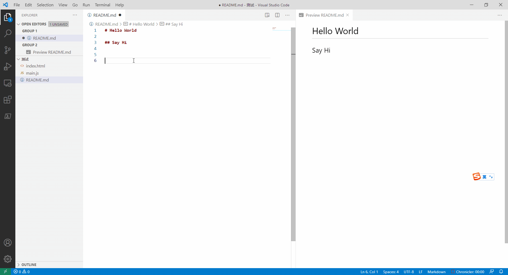

# mdcpy 

mdcpy 在markdown文件实现`ctrl+v`粘贴剪贴板内的图片。

图片将会保存在正在编辑文件的同级目录内，如果同级目录下存在`img`目录，那么将会保存到`img`目录下。

- 仅支持`Windows`

使用过程就是，截图之后直接在markdown文件内`ctrl+v`就行：

该项目参考了： [mushanshitiancai . vscode-paste-image](https://github.com/mushanshitiancai/vscode-paste-image)